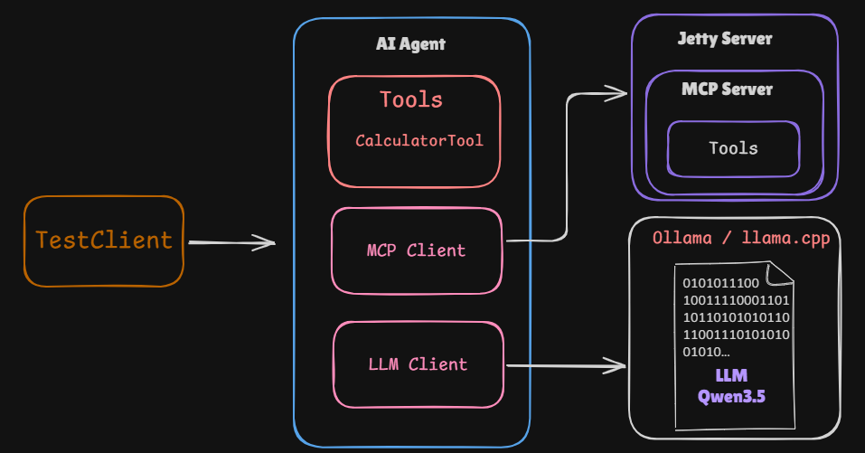

# AI Agent and MCP Server

A simple implementation demonstrating how to build an **AI Agent and MCP Server using Java and LangChain4j**.

The project demonstrates how an AI Agent can use tools exposed by an MCP Server while running the LLM locally.

## How It Works

1. **Run the LLM locally** using either **Ollama** or **llama.cpp**.
2. Start `src/main/java/com/ai/mcp/server/HTTPServer.java` to expose the available tools through the MCP Server.
3. Run `src/main/java/com/ai/client/TestClient.java` to send prompts to the AI Agent.
4. The Agent determines when a tool is required and invokes the appropriate tool through the MCP Server.

### Architecture

```text
                  ┌─────────────────────┐
                  │   Ollama / llama.cpp│
                  │     Local LLM       │
                  └──────────┬──────────┘
                             │
                             ▼
                  ┌─────────────────────┐
                  │      AI Agent       │
                  │     LangChain4j     │
                  └──────────┬──────────┘
                             │
                        MCP Client
                             │
                             │ HTTP
                             ▼
                  ┌─────────────────────┐
                  │     MCP Server      │
                  │    HTTPServer.java  │
                  └──────────┬──────────┘
                             │
                             ▼
                  ┌─────────────────────┐
                  │        Tools        │
                  └─────────────────────┘
```

## Running the Project

### 1. Start the local LLM

You can use either Ollama or llama.cpp.

For example, with Ollama:

```bash
ollama run qwen2.5:7b
```

Or start a compatible model using `llama.cpp`.

### 2. Start the MCP Server

Run:

```text
src/main/java/com/ai/mcp/server/HTTPServer.java
```

The MCP Server exposes the tools through HTTP.

### 3. Run the Client

Then run:

```text
src/main/java/com/ai/client/TestClient.java
```

The client sends prompts to the Agent.

The Agent can determine whether it needs to invoke an MCP tool, and the MCP Client communicates with the MCP Server to execute that tool.

## Request Flow

```text
User Prompt
     │
     ▼
TestClient
     │
     ▼
AI Agent
     │
     ▼
Local LLM
     │
     │ decides to use a tool
     ▼
MCP Client
     │
     │ HTTP / MCP
     ▼
MCP Server
     │
     ▼
Tool Execution
     │
     ▼
Tool Result
     │
     ▼
MCP Client
     │
     ▼
AI Agent
     │
     ▼
Final Response
```

This project is intended as a simple example for understanding the relationship between **AI Agents, LangChain4j, MCP Clients, MCP Servers, and local LLMs**.




